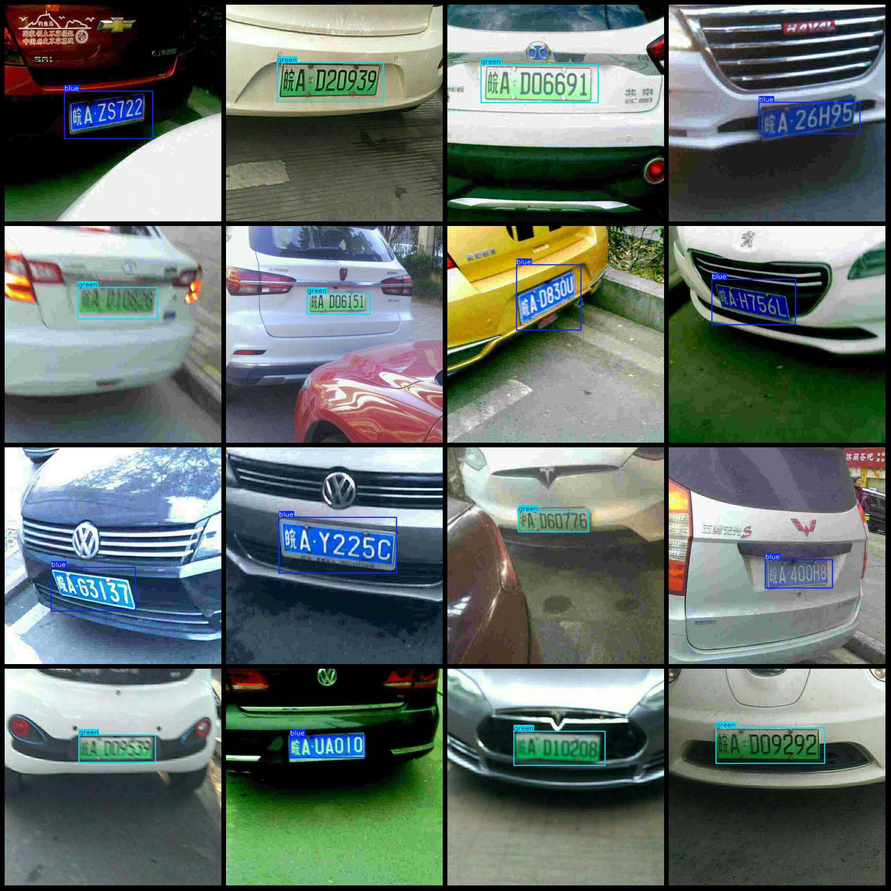

# China Blue and Green Vehicle Plate Test Data Set in Pascal VOC+YOLO Format with 2200 Categories

Dataset format: Pascal VOC format + YOLO format (txt files without split paths, only containing jpg images along with corresponding VOC format xml files and yolo format txt files)
Number of images (jpg file count): 2198
Number of annotations (xml file count): 2198
Number of annotations (txt file count): 2198
Number of categories: 2
Category names for annotations (note that the order of categories in the yolo format does not match this, but is based on the labels folder's classes.txt): ["blue", "green"]
Number of bounding boxes per category:
- Blue boxes = 1105
- Green boxes = 1101
Total bounding boxes = 2206
Image resolution: 640x640
Annotation tool used: labelImg
Annotation rules: Draw bounding boxes for categories
Important note: The dataset does not have been split into training, validation, or test sets; you should divide it yourself.
Special statement: This dataset does not guarantee any accuracy of the trained models or weight files.
Image preview:
Annotation example:

## Image

Here is a pay link on Stripe ( https://buy.stripe.com/3cs8yP7sY87d0vu9AB ). Please contact me lonlonago@foxmail.com after funding $89, and I will send you a complete data files , thank you!

